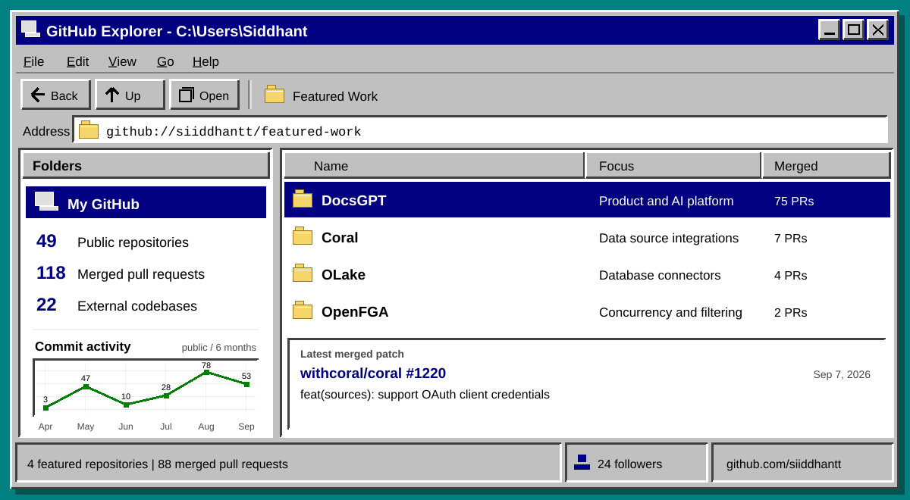

# hey, i'm siddhant 👋

```text
backend engineer by trade
open-source side-quest enjoyer
currently making AI systems less mysterious in production
```

I like the part of software where a vague idea has to survive contact with real users,
real data, flaky dependencies, and an alert firing at 2 AM.

Right now I am building around **backend systems, developer tooling, observability,
and AI infrastructure**. I care about useful software, evidence over vibes, and code
that another human can operate after the demo ends.

<br clear="right">

<p align="center">
  <a href="https://s1d.is-a.dev"></a>
  <a href="https://s1d.is-a.dev/resume.pdf"></a>
  <a href="https://www.linkedin.com/in/siddhant-rai21"></a>
  <a href="mailto:siddhant.rai.5686@gmail.com"></a>
</p>

## `~/live`

<picture>
  <source media="(prefers-color-scheme: dark)" srcset="./assets/live-dark.svg">
  <source media="(prefers-color-scheme: light)" srcset="./assets/live-light.svg">
  
</picture>

<p align="center">
  <sub>Generated from the GitHub API. The workflow refreshes it only when the data changes.</sub>
</p>

## `~/things-i-have-been-cooking`

<table>
  <tr>
    <td width="33%" valign="top">
      <h3><a href="https://github.com/siiddhantt/mizaaj">Mizaaj</a> <sup><a href="https://mizaaj-ai.vercel.app">demo</a></sup></h3>
      <p>A private fit-memory assistant grounded in product evidence, personal preferences, and real purchase outcomes.</p>
      <code>Python</code> <code>FastAPI</code> <code>Postgres</code> <code>Cognee</code>
    </td>
    <td width="33%" valign="top">
      <h3><a href="https://github.com/siiddhantt/margintrace">MarginTrace</a> <sup><a href="https://margintrace-nu.vercel.app">demo</a></sup></h3>
      <p>Measures verified outcomes, cost, waste, and policy decisions across AI workflows.</p>
      <code>TypeScript</code> <code>OTel</code> <code>SigNoz</code>
    </td>
    <td width="33%" valign="top">
      <h3><a href="https://github.com/siiddhantt/reefwatch">ReefWatch</a> <sup><a href="https://reefwatch-coral.vercel.app">demo</a></sup></h3>
      <p>Investigates incidents across production sources through runtime discovery and read-only SQL.</p>
      <code>Python</code> <code>Coral</code> <code>MCP</code>
    </td>
  </tr>
</table>

## `~/open-source-side-quests`

- taught [Coral](https://github.com/withcoral/coral) to speak to more APIs and live data sources
- made [OLake](https://github.com/datazip-inc/olake) database connectors friendlier to real infrastructure
- tightened concurrency and tuple filtering in [OpenFGA](https://github.com/openfga/openfga)
- improved provider compatibility and test hygiene in [mcp-use](https://github.com/mcp-use/mcp-use)
- shipped a lot of agent, ingestion, API, and product work in [DocsGPT](https://github.com/arc53/DocsGPT)

<p align="right">
  <a href="https://github.com/pulls?q=is%3Apr+author%3Asiiddhantt+is%3Amerged">all merged pull requests -&gt;</a>
</p>

## `~/toolbox`

```text
languages   Python / Go / TypeScript / JavaScript
backend     FastAPI / Node.js / REST / GraphQL / event-driven systems
data        PostgreSQL / Redis / MongoDB / SQLite
shipping    Docker / Kubernetes / AWS / GitHub Actions
signals     OpenTelemetry / SigNoz / traces / logs / metrics
```

<details>
  <summary><strong>when I am not coding</strong></summary>
  <br>

  Mostly watching films, listening to music, or playing video games.
</details>
