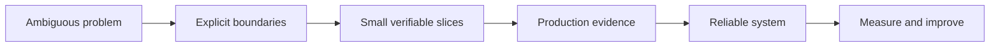

<picture>
  <source media="(prefers-color-scheme: dark)" srcset="./assets/header-dark.svg">
  <source media="(prefers-color-scheme: light)" srcset="./assets/header-light.svg">
  
</picture>

<p align="center">
  <a href="https://s1d.is-a.dev"></a>
  <a href="https://s1d.is-a.dev/resume.pdf"></a>
  <a href="https://www.linkedin.com/in/siddhant-rai21"></a>
  <a href="mailto:siddhant.rai.5686@gmail.com"></a>
</p>

<p align="center">
  I build reliable software at the intersection of backend systems, developer tooling,<br>
  observability, and AI infrastructure.
</p>

<p align="center">
  <code>Python</code>&nbsp;&nbsp;
  <code>Go</code>&nbsp;&nbsp;
  <code>TypeScript</code>&nbsp;&nbsp;
  <code>FastAPI</code>&nbsp;&nbsp;
  <code>Node.js</code>&nbsp;&nbsp;
  <code>PostgreSQL</code>&nbsp;&nbsp;
  <code>Redis</code>&nbsp;&nbsp;
  <code>Docker</code>&nbsp;&nbsp;
  <code>OpenTelemetry</code>
</p>

## 01 / Current signal

```text
focus     reliable backend systems, AI infrastructure, and production observability
building  outcome-aware agent workflows with explicit cost, evidence, and guardrails
shipping  open-source improvements across data, authorization, and agent tooling
open to   backend and software engineering roles in India or remote
```

## 02 / Selected systems

<table>
  <tr>
    <td width="33%" valign="top">
      <h3><a href="https://github.com/siiddhantt/margintrace">MarginTrace</a></h3>
      <p>Outcome economics and runtime guardrails for AI workflows. Connects verified results, model and tool cost, retry waste, and pre-spend policy through OpenTelemetry and SigNoz.</p>
      <p><code>TypeScript</code> <code>OpenTelemetry</code> <code>SigNoz</code></p>
      <a href="https://margintrace-nu.vercel.app">Live console</a>
    </td>
    <td width="33%" valign="top">
      <h3><a href="https://github.com/siiddhantt/reefwatch">ReefWatch</a></h3>
      <p>A Coral-powered investigation workspace that discovers production sources at runtime, queries evidence through read-only SQL, and produces defensible incident reports.</p>
      <p><code>Python</code> <code>FastAPI</code> <code>Coral MCP</code></p>
      <a href="https://reefwatch-coral.vercel.app">Live workspace</a>
    </td>
    <td width="33%" valign="top">
      <h3><a href="https://github.com/siiddhantt/buildmedic">BuildMedic</a></h3>
      <p>A read-only, multi-agent CI failure assistant that turns noisy GitHub Actions failures into evidence-backed diagnoses, minimal patch proposals, and review verdicts.</p>
      <p><code>Next.js</code> <code>TypeScript</code> <code>SQLite</code></p>
      <a href="https://github.com/siiddhantt/buildmedic#demo-path">Demo path</a>
    </td>
  </tr>
</table>

## 03 / Open-source footprint

<p>
  <strong>100+ public merged pull requests</strong> across product engineering, data connectors,
  authorization, observability, and agent infrastructure.
</p>

| Project | Signal | Engineering work |
| :-- | --: | :-- |
| [DocsGPT](https://github.com/arc53/DocsGPT) | **75 merged PRs** | Agent tooling, ingestion connectors, APIs, accessibility, and full-stack product delivery |
| [Coral](https://github.com/withcoral/coral) | **6 merged PRs** | Google Docs, Drive, Search Console, OSV, and Netlify data sources plus validation hardening |
| [OLake](https://github.com/datazip-inc/olake) | **3 merged PRs** | SSH support for DB2 and MSSQL, MySQL SSL configuration, and Oracle sync progress tracking |
| [OpenFGA](https://github.com/openfga/openfga) | **2 merged PRs** | Thread-safe request cloning and more flexible tuple filtering |
| [mcp-use](https://github.com/mcp-use/mcp-use) | **2 merged PRs** | Custom OpenAI-compatible provider URLs and explicit test dependencies |

<p align="right">
  <a href="https://github.com/pulls?q=is%3Apr+author%3Asiiddhantt+is%3Amerged">Explore all merged pull requests -&gt;</a>
</p>

## 04 / How I engineer



- I prefer proof over claims: runnable systems, merged patches, tests, traces, and documented tradeoffs.
- I design for failure paths, operator visibility, and safe defaults before calling a feature complete.
- I enjoy codebases where product behavior, infrastructure, and developer experience meet.

<details>
  <summary><strong>More things I have built</strong></summary>
  <br>

  - [Mizaaj](https://github.com/siiddhantt/mizaaj): private AI fit-memory with grounded recall, evidence capture, and purchase outcomes.
  - [SigNoz HTTP 200 Failure Lab](https://github.com/siiddhantt/signoz-http-200-failure-lab): a runnable OpenTelemetry lab for business failures hidden behind successful transport responses.
  - [GitHitBox](https://github.com/siiddhantt/githitbox): a reusable GitHub profile hit-counter service that returns badge images.
</details>

<br>

<p align="center">
  <strong>Building something difficult, useful, and operationally real?</strong><br>
  <a href="mailto:siddhant.rai.5686@gmail.com">siddhant.rai.5686@gmail.com</a>
</p>

<p align="center">
  <sub>Designed as an engineering profile, not a badge collection.</sub>
</p>
